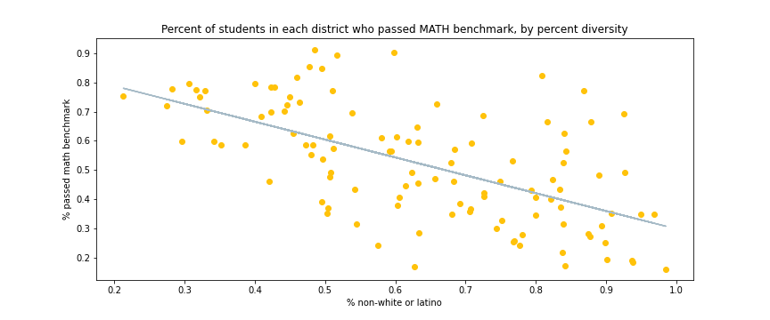

## Problem Statement 
While some critics argue that standardized testing is not discriminatory, differences in test scores underline inequality in education.
This analysis seeks to investigate the association between diversity, participation, and SAT test scores among California students. 

## Executive Summary
SAT scores are used for college admissions and scholarship opportunities in the United States. However, Black and Latino students routinely score lower than their  white, non-Latino  peers, particularly on the math section. 

## Data 
*The analysis leverages an intersectional definition of diversity, including all non-white/ non-Hispanic minorities, recognizing that smaller minority populations face many of the same challenges as Blacks and Latinos, but with less public attention.*

- [2019 SAT Scores](https://www.cde.ca.gov/ds/sp/ai/) **in California by School** [Data Dictionary](https://www.cde.ca.gov/ds/sp/ai/reclayoutsat19.asp)

 
         Variable                 Description 

        DName                    School District 
        Enroll12                 Number enrolled in grade 12
        NumTSTTakr12             Number who took the SAT in grade 12
        NumERWBenchmark12        Number who passed the ERW benchmark of the SAT in grade 12
        NumMathBenchmark12       Number who passed the Math benchmark of the SAT in grade 12
        TotNumBothBenchmark12    Number who passed BOTH benchmarks of the SAT in grade 12
        PctERWBenchmark12        % who passed the ERW benchmark of the SAT in grade 12*
        PctMathBenchmark12       % who passed the Math benchmark of the SAT in grade 12*
        PctBothBenchmark12       % who passed BOTH benchmarks of the SAT in grade 12*
        PctTst                   % of enrolled students who took the SAT in grade 12
       
        *Percentages were recalculated after data were aggregated to Unified School District level
        
        n = 114 After restricting to Unified School district and merging with ACS data set
  
- [2019 ACS](https://data.census.gov/cedsci/table?t=Race%20and%20Ethnicity&g=0400000US06&y=2019&d=ACS%201-Year%20Estimates%20Data%20Profiles&tid=ACSDP1Y2019.DP05&moe=false&tp=true&hidePreview=true) **American Community Survey- Census Bureau** [Data Dictionary](https://www.census.gov/programs-surveys/acs/microdata/documentation.html)

        ACS DEMOGRAPHIC AND HOUSING ESTIMATES for Californina Unified School Districts 
                DP05_0070E      Estimate!!HISPANIC OR LATINO AND RACE!!Total population
                DP05_0070E      Estimate!!HISPANIC OR LATINO AND RACE!!Total population!!
                Not Hispanic or Latino!!White alone 
        
        DIVERSITY MEASURE (PREDICTOR): 
                Percent hispanic or non-white   =       
                [Total population] - [Population white and non-Hispanic] / [Total population]

        
 - A `linear slope line` was used to evaluate the direction of the relationship between the *Diversity Measure* and the percentage of 12th grade students who passed the benchmarks for tests.

  ## Conclusions
- *SAT participation*: Most schools had less than 50% participation in the test, regardless of percent diversity.

- *Math Score*: More diverse districts had Lower Math Scores and more variance than less diverse school districts. School districts that were majority white had a higher percent who passed benchmark. 

- *English Score*: Similarly, the more diverse a school district, the lower the percent who passed the benchmark.

- *Both Benchmarks*: Probability of passing both tests declined the more diverse a school was.

While the [University of California](https://www.universityofcalifornia.edu/press-room/university-california-board-regents-approves-changes-standardized-testing-requirement/) won't consider SAT and ACT scores between fall 2021 and spring 2025, it is unclear if the test will return in the future. It is critical that higher education systems and school districts find ways to identify students' unique strengths and potential rather than use proxies like test scores which may be biased by race and educational access.   

## References
1. [Statology: Regression Line](https://www.statology.org/scatterplot-with-regression-line-python/)
2. [Smithsonian: Has the Pandemic Put an End to the SAT and ACT](https://www.smithsonianmag.com/innovation/has-pandemic-put-end-to-sat-act-180978167/)
3. [University of Chicago: Addressing Educational Inequality](https://uei.uchicago.edu/sites/default/files/documents/UEI%202017%20New%20Knowledge%20-%20Addressing%20Educational%20Inequality.pdf)
